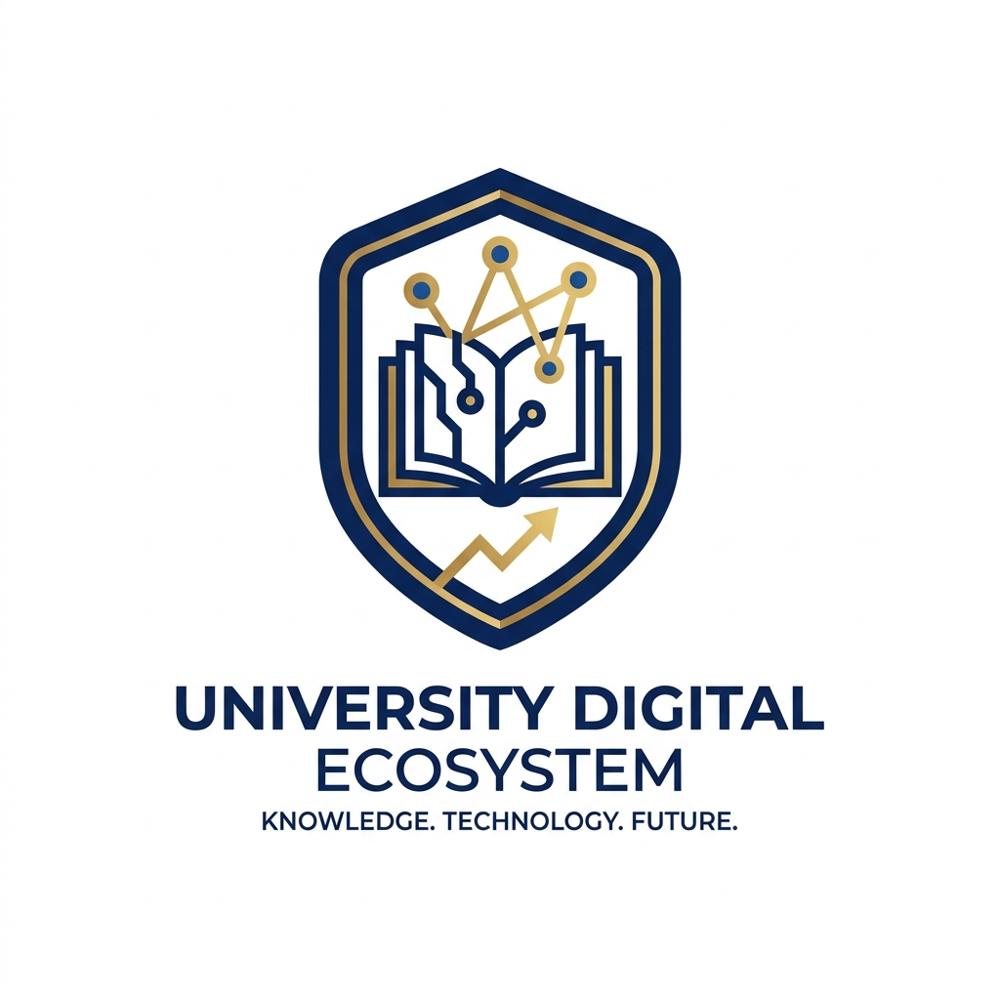
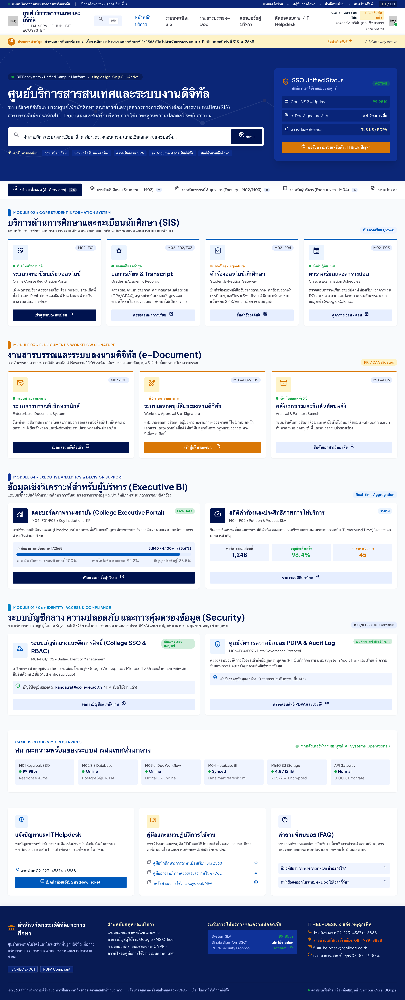
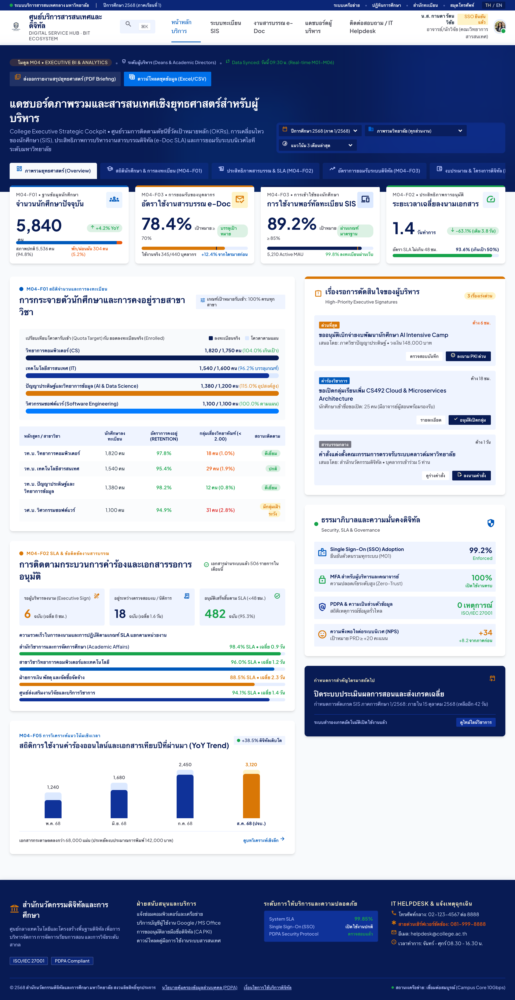
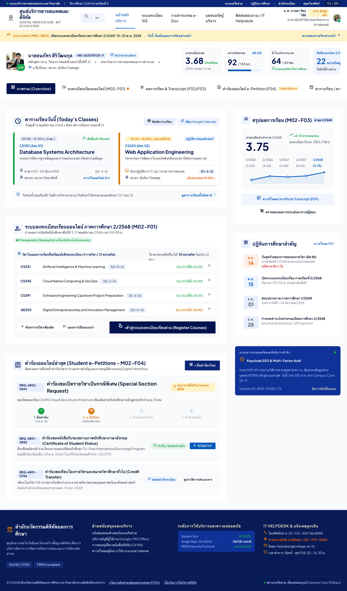
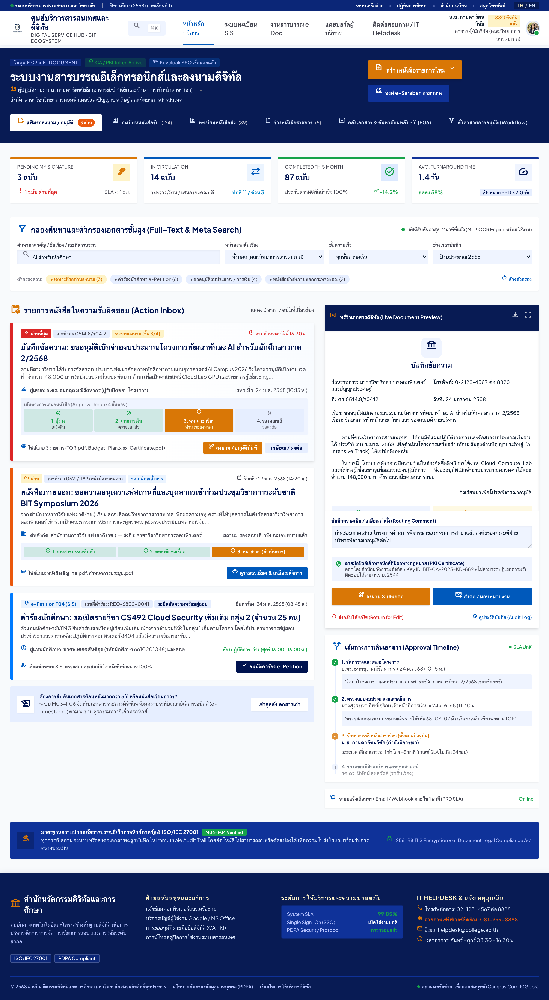
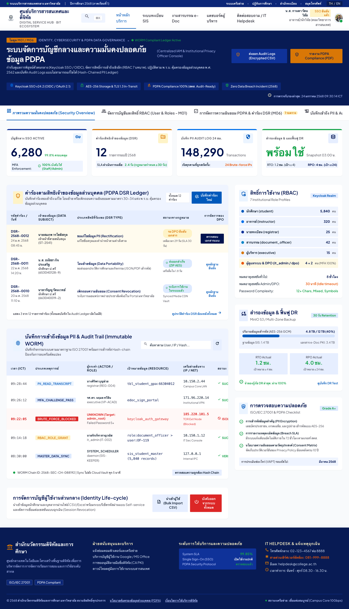
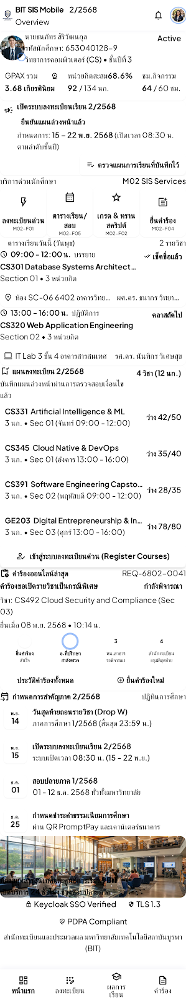
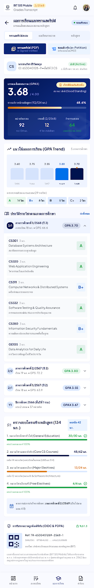

<div align="center">



# College Digital Ecosystem MVP
### ระบบนิเวศดิจิทัลเพื่อการศึกษาและการบริการสารสนเทศแบบครบวงจร

[](https://www.typescriptlang.org/)
[](https://nextjs.org/)
[](https://www.fastify.io/)
[](https://tailwindcss.com/)
[](https://www.prisma.io/)
[](https://www.postgresql.org/)
[](https://turbo.build/)

</div>

---

## 📸 แกลเลอรีภาพตัวอย่างหน้าจอระบบ (GUI Showcase)

ระบบถูกออกแบบภายใต้ **Google Stitch Design System** เน้นโทนสีสถาบัน Deep Navy (`#081B54`), Amber Gold (`#D97706`) และ Modern Surface Canvas พร้อมฟอนต์ภาษาไทย **Sarabun** และ **Plus Jakarta Sans** รองรับ Responsive Desktop & Mobile 100%

### 1. Web Portal — ศูนย์บริการดิจิทัลนักศึกษาและบุคลากร (Service Hub)
หน้าพอร์ทัลหลักสำหรับนักศึกษา อาจารย์ และบุคลากร ในการเข้าถึงบริการลงทะเบียน ส่งคำร้องออนไลน์ และตรวจสอบสถานะคำร้อง

<p align="center">
  
</p>

---

### 2. Admin Console — แดชบอร์ดผู้บริหารและการตรวจสอบระบบ (Executive Dashboard)
ศูนย์กลางการบริหารจัดการระบบ, การวิเคราะห์ข้อมูลสถิติ (KPIs), ตรวจสอบความพร้อมของ Microservices และตรวจสอบ Audit Logs แบบ Real-time

<p align="center">
  
</p>

---

### 3. Core SIS Portal — ระบบทะเบียนและบริการการศึกษา (Student Information System)
ระบบจัดการหลักสูตร, แผนการเรียน, ตารางสอน, ตารางสอบ และระบบลงทะเบียนเรียนพร้อม Atomic Seat Locking ป้องกันการลงทะเบียนเกินจำนวนที่นั่ง

<p align="center">
  
</p>

---

### 4. e-Document & Approval Workflow — ระบบเอกสารดิจิทัลและการอนุมัติ
ระบบติดตามกระบวนการไหลของคำร้องและการลงนามดิจิทัล (Digital Signature with SHA-256) ตรวจสอบความถูกต้องของเอกสารได้ทันที

<p align="center">
  
</p>

---

### 5. PDPA & Identity Governance — การจัดการความปลอดภัยและข้อมูลส่วนบุคคล
ระบบบริหารจัดการสิทธิ์ (RBAC), ตรวจสอบการเข้าถึงข้อมูลที่มีความอ่อนไหว (PII Access Audit Log) และการเข้ารหัส AES-256-GCM ตาม พ.ร.บ. คุ้มครองข้อมูลส่วนบุคคล (PDPA)

<p align="center">
  
</p>

---

### 6. Mobile Experience — ระบบบริการการศึกษาและทรานสคริปต์บนมือถือ
รองรับการแสดงผลหน้าทะเบียน ผลการเรียน ทรานสคริปต์ดิจิทัล และตารางเรียนอย่างสมบูรณ์แบบบนสมาร์ตโฟน

<p align="center">
  
  &nbsp;&nbsp;&nbsp;&nbsp;
  
</p>

---

## 🏛️ สถาปัตยกรรมระบบ (System Architecture)

ระบบถูกสร้างขึ้นในรูปแบบ **Turborepo Monorepo** ขนาด 14 Workspaces สอดคล้องตามมาตรฐานความปลอดภัยระดับองค์กร:

```
├── apps/
│   ├── web/              # Next.js 14 Web Portal สำหรับนักศึกษาและอาจารย์ (Port 3000)
│   ├── admin/            # Next.js 14 Admin Console สำหรับผู้บริหารและเจ้าหน้าที่ (Port 3001)
│   └── api-gateway/      # Fastify Dynamic Reverse Proxy Router (Port 4000)
├── services/
│   ├── identity/         # Microservice: Keycloak SSO, RBAC Matrix, PII Encryption (Port 4001)
│   ├── sis/              # Microservice: ทะเบียน, นักศึกษา, รายวิชา, Atomic Seat Locking (Port 4002)
│   ├── document/         # Microservice: e-Document Workflow, State Machine, Local Disk Store (Port 4003)
│   ├── analytics/        # Microservice: KPI Metrics Engine, Turnaround Times (Port 4004)
│   └── notification/     # Microservice: Event-driven Messaging Queue (Port 4005)
├── packages/
│   ├── ui/               # Reusable UI Library (Tailwind CSS + Lucide Icons)
│   ├── types/            # Shared DTOs, API Contracts, TypeScript Interfaces
│   ├── db/               # Prisma ORM Schema (16 Models) & Database Migrations
│   ├── utils/            # AES-256-GCM Cryptography, PII Masking, Thai Date Formatter
│   └── config/           # Shared ESLint, Prettier, TypeScript Configurations
└── docs/
    ├── screenshots/      # ภาพแคปหน้าจอ GUI แสดงผลจริงของระบบ
    └── gui-prototypes/   # ต้นแบบโค้ด HTML สำหรับแต่ละหน้าจอ
```

---

## 🚀 วิธีการติดตั้งและเปิดใช้งาน (Quick Start)

### ข้อกำหนดขั้นต่ำ
- **Node.js**: v20.x หรือสูงกว่า
- **pnpm**: v9.x หรือสูงกว่า
- **Docker & Docker Compose** (สำหรับ PostgreSQL 16 และ RabbitMQ)

### 1. โคลนคลังโค้ด (Clone Repository)
```bash
git clone https://github.com/vipmcu/College-Digital-Ecosystem.git
cd College-Digital-Ecosystem
```

### 2. ติดตั้ง Dependencies
```bash
pnpm install
```

### 3. เปิดบริการฐานข้อมูล (Start Database Containers)
```bash
docker compose up -d
```

### 4. สร้าง Schema และเตรียมข้อมูลจำลอง (Prisma & Seed Data)
```bash
pnpm --filter @repo/db exec prisma generate
pnpm --filter @repo/db exec prisma migrate deploy
pnpm run seed
```

### 5. เปิดรันระบบทั้งหมด (Start Full Monorepo)
```bash
pnpm turbo run dev
```

---

## 🌐 พอร์ตและบริการในระบบ (Service Endpoints)

| Service | Port | Endpoint URL | เทคโนโลยี |
|---|:---:|---|---|
| **Web Portal** | 3000 | [http://localhost:3000](http://localhost:3000) | Next.js 14, Tailwind, NextAuth |
| **Admin Console** | 3001 | [http://localhost:3001](http://localhost:3001) | Next.js 14, Tailwind, Lucide |
| **API Gateway** | 4000 | [http://localhost:4000](http://localhost:4000) | Fastify Dynamic Router |
| **Identity Service** | 4001 | `http://localhost:4001/api/v1/auth` | Fastify, AES-256, Audit Logger |
| **SIS Service** | 4002 | `http://localhost:4002/api/v1/sis` | Fastify, Atomic Transactions |
| **Document Service** | 4003 | `http://localhost:4003/api/v1/documents` | Fastify, Local Disk + SHA-256 |
| **Analytics Service** | 4004 | `http://localhost:4004/api/v1/analytics` | Fastify, KPI Metrics Engine |
| **Notification Service** | 4005 | `http://localhost:4005/api/v1/notifications` | Fastify, Event-driven |
| **PostgreSQL 16** | 5432 | `localhost:5432` | Docker Database Engine |

---

## 🔑 บัญชีผู้ใช้สำหรับการทดสอบ (Demo Accounts)

| สิทธิ์การใช้งาน (Role) | ชื่อผู้ใช้งาน (Username) | รหัสผ่าน (Password) | สิทธิ์การเข้าถึง |
|---|---|---|---|
| **ผู้ดูแลระบบไอที (IT Admin)** | `admin` | `adminpassword` | เข้าถึง Admin Console และตั้งค่าระบบทั้งหมด |
| **อาจารย์ผู้สอน (Instructor)** | `instructor01` | `password123` | จัดการเกรด ตรวจสอบตารางสอน ลงนามคำร้อง |
| **นักศึกษา (Student)** | `student01` | `password123` | ลงทะเบียนเรียน ยื่นเอกสารคำร้องออนไลน์ |

---

## 🛡️ มาตรฐานความปลอดภัยและการคุ้มครองข้อมูลส่วนบุคคล (Security & PDPA)
* **Rule S-01**: ปราศจาก Hardcoded Secrets 100%
* **Rule S-02**: ซ่อนข้อมูลอ่อนไหว (PII Masking) จากไฟล์ Log ทุกประเภท
* **Rule S-03**: ตรวจสอบสิทธิ์ (Authentication & RBAC Middleware) ทุก Protected Routes
* **Rule S-04**: ตรวจสอบ Schema ของ Request Payload ด้วย Zod ก่อนประมวลผล
* **Rule S-05**: บันทึก Audit Log ทุกครั้งที่มีการเรียกอ่านหรือเขียนข้อมูล PII

---

## 📄 ใบอนุญาต (License)
โครงการนี้พัฒนาภายใต้สัญญาอนุญาต **MIT License** — สงวนลิขสิทธิ์ พ.ศ. 2569
